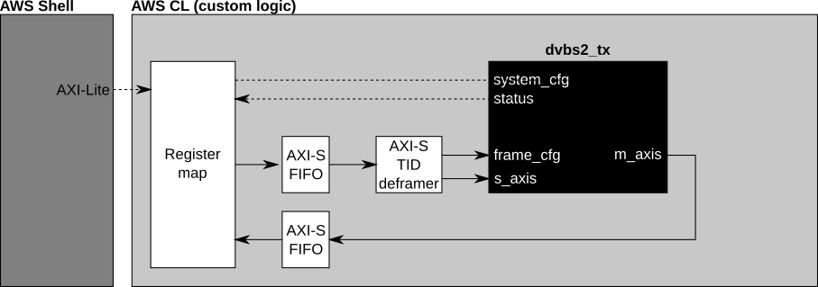
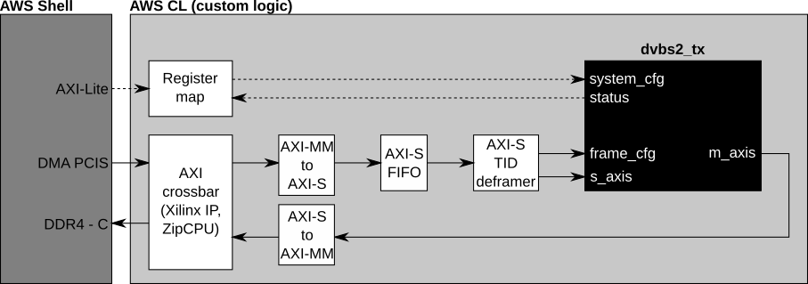
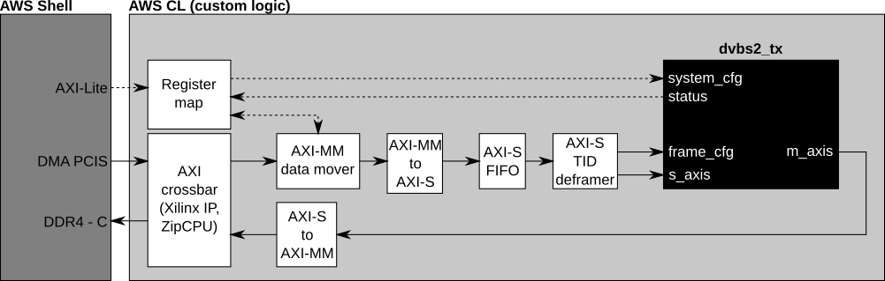

# DVB S2 transmitter on AWS F1

This is an attempt to define how the [dvb_fpga][dvb_fpga] RTL should look like
when running on AWS F1 instances. The alternatives below should allow the group
to understand pros and cons and decide for the one that best suits the project.

Details on the AWS F1 shell can be found at [AWS F1 shell specification][aws_f1_shell]

## Alternative 1: proof of concept

This alternative is likely the fastest to get up and running at the expense of
performance: using the AXI-Lite bus for sending and receiving data. The
downstream FIFO could be made into a packet FIFO to allow the host to write to it
slowly and then drive the DVB-S2 Tx subsystem at maximum bandwidth.

Interpreting AXI-Lite only needs to be done once, so no converters are needed.

|  |
| :---:                                     |
| Alternative 1: Proof of concept           |

## Alternative 2: requires host heavy lifting

In this alternative, the data path is moved to the `DMA_PCIS`, which allows
higher bandwidth but still depends heavily on the host for performance. Data
produced by the DVB Tx subsystem is written to DDR and can be read through
`DMA_PCIS` as well.

Generally AXI crossbars are limited to AXI-MM, so converting from/to AXI-MM/AXI-S
is required.

|  |
| :---:                                     |
| Alternative 2: Host drives data           |

## Alternative 3: card is the master

Here the host's work is reduced a bit more. The host prepares the DDR with data +
per frame config and configures the AXI data mover to fetch it. Data produced by
the DVB-S2 Tx subsystem is written to the same DDR, either on a region that's
either configured by the host or determined at synthesis time.

In addition to the AXI-MM/AXI-S converters mentioned above, an AXI data mover is
also needed to move data from the DDR to the DVB-S2 Tx subsystem.

|  |
| :---:                                         |
| Alternative 3: Card is the master             |

[aws_f1_shell]: https://github.com/aws/aws-fpga/blob/master/hdk/docs/AWS_Shell_Interface_Specification.md
[dvb_fpga]: https://github.com/phase4ground/dvb_fpga
